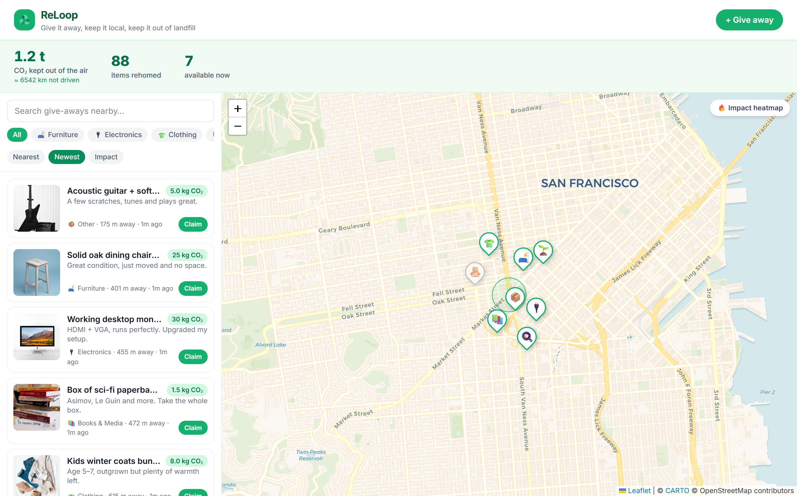

# ♻️ ReLoop

**Give it away, keep it local, keep it out of landfill.**



🔗 **Live app:** https://reloop-six-beta.vercel.app

ReLoop is a hyperlocal give-away map. Instead of throwing usable things in the
bin, neighbours post them with a photo; anyone nearby can claim and collect them.
An AI vision model identifies each item and estimates the CO₂ kept out of the
atmosphere, and a live community counter turns everyday reuse into visible impact.

Built for **TechCommons Hacks V1** — theme: *Global & Local Impact*.

---

## The problem

Reusable furniture, electronics, clothes, and kitchenware get thrown out every
day because giving them away is more effort than binning them. That's avoidable
waste and avoidable carbon — a working monitor in landfill is ~30 kg CO₂e that a
neighbour two streets over would happily have used.

## How ReLoop helps

- **Lowers the effort of giving.** Snap a photo → the AI writes the listing (title,
  category) and estimates the impact → post. Seconds, not a marketplace listing.
- **Keeps it local.** A map + PostGIS distance search surface what's within walking
  distance, so items actually get collected instead of shipped or forgotten.
- **Makes impact visible.** Every rehomed item adds to a community CO₂ counter with
  relatable equivalents ("≈ 130 km not driven"), turning small acts into momentum.

---

## Tech

| Layer | Choice |
|---|---|
| Frontend | React 19 + Vite + TypeScript + Tailwind CSS v4 |
| Map | Leaflet + OpenStreetMap/CARTO tiles, custom pins, live impact **heatmap** (leaflet.heat) |
| Backend | Supabase — Postgres + **PostGIS**, Auth (anonymous), Storage, **Realtime** |
| Geo | `items_near()` RPC using `ST_DWithin` / `ST_Distance` for true nearest-item search |
| AI | Supabase Edge Function (Deno) → OpenAI vision (`gpt-4o-mini`); CO₂ computed server-side from a fixed lifecycle-based table, adjusted by detected condition |
| Realtime | New give-aways and claims appear on every open map instantly |

Why it's not a thin AI wrapper: the vision call is one contained component of a
real system — spatial queries in the database, row-level security, an anonymous
identity per user, a `SECURITY DEFINER` claim RPC that prevents race conditions,
live subscriptions, and photo storage all do the heavy lifting.

---

## Running locally

```bash
npm install
npm run dev
```

The app runs immediately in **demo mode** with mock give-aways scattered around
your location and a local AI fallback — no backend required.

### Going live (Supabase + OpenAI)

1. Create a Supabase project. Apply the migration in `supabase/migrations/` and
   deploy the edge function:
   ```bash
   npx supabase link --project-ref <your-ref>
   npx supabase db push
   npx supabase functions deploy analyze
   ```
2. Enable **Anonymous sign-ins** (Supabase → Authentication → Providers).
3. Set the vision key as a server-side secret (never in the frontend):
   ```bash
   npx supabase secrets set OPENAI_API_KEY=sk-...
   ```
4. Copy `.env.example` → `.env.local` and fill in your project URL, anon key, and
   the `analyze` function URL.
5. `npm run dev` — the app now uses live data, auth, storage, and realtime.

---

## Project structure

```
src/
  components/   Header, ImpactBar, MapView, Feed, ItemCard, PostItemModal
  lib/          types, impact (CO₂ model), geo (haversine), api (Supabase), ai (vision), mock
  hooks/        useCountUp (animated stats)
supabase/
  migrations/   schema: items table, PostGIS RPCs, RLS, storage, realtime
  functions/    analyze — OpenAI vision edge function
```

## Impact estimates

CO₂ figures are conservative midpoints drawn from lifecycle-analysis literature
(WRAP, EPA WARM) and are illustrative — the goal is to make reuse *feel*
consequential, not to be an audited carbon ledger.
